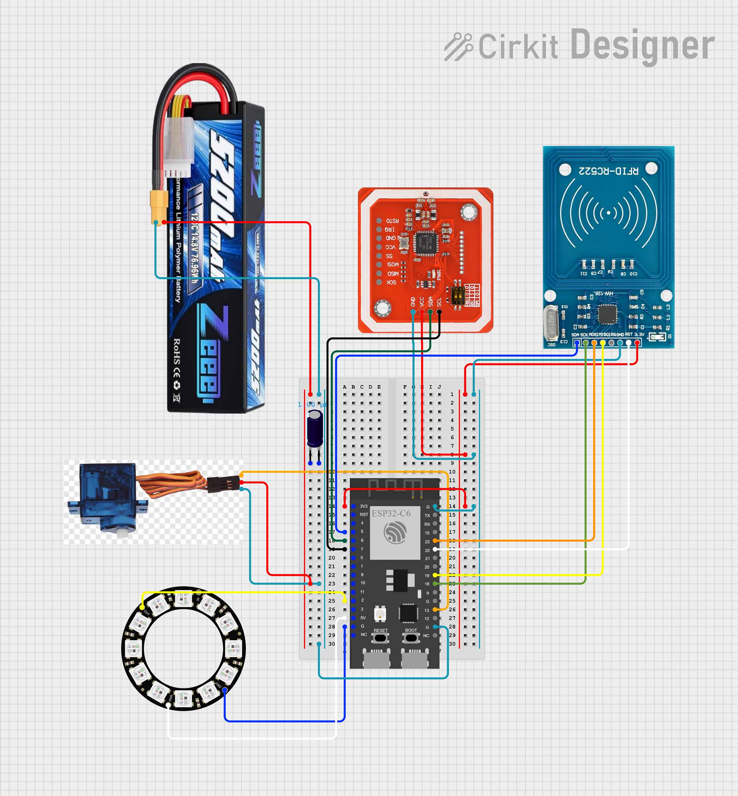
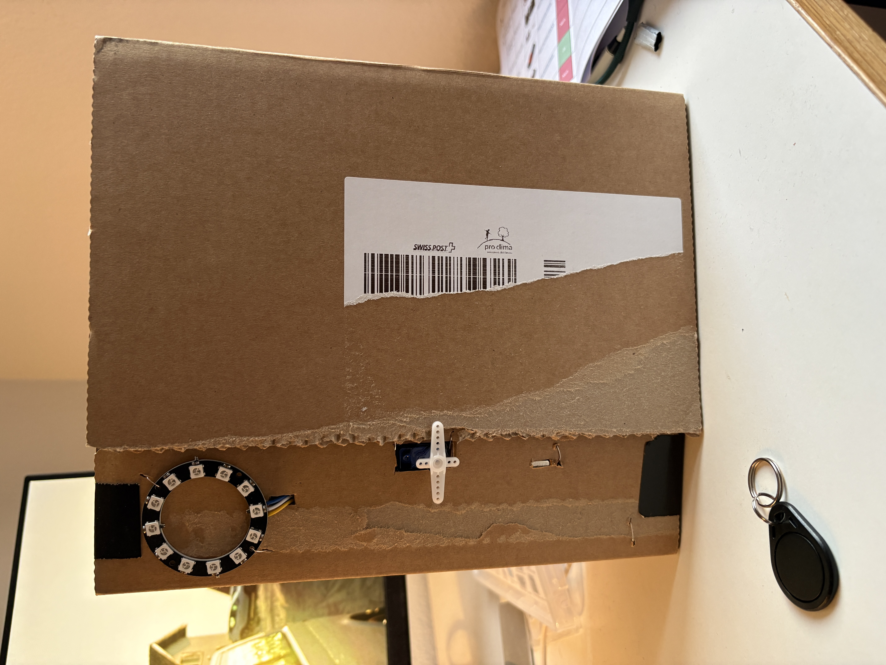
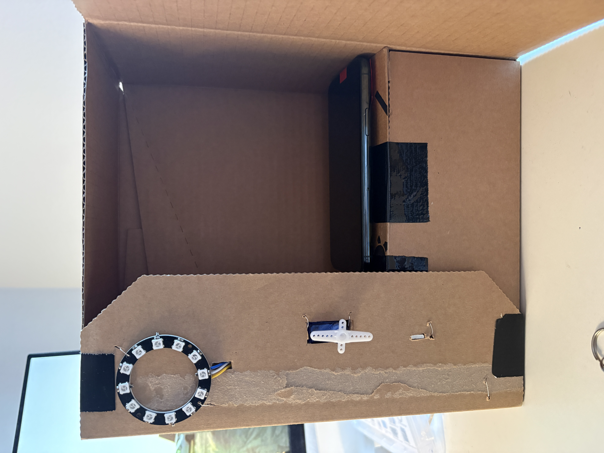
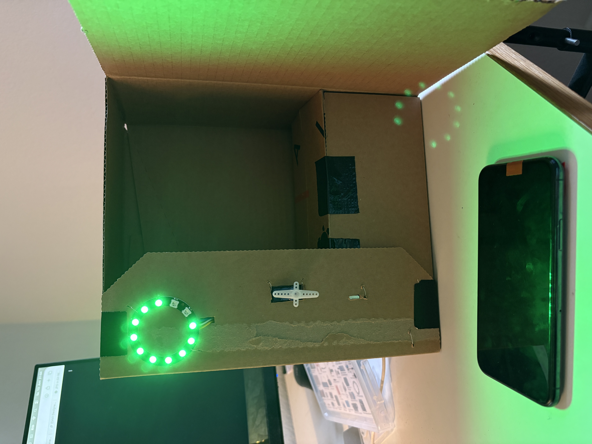

**Kurzbeschreibung des Projekts**

- **Modul:** Interaktive Medien 4 an der Fachhochschule Graubünden (FS26)
- **Themenfeld:** IoT-Applikation für Eltern mit kleinen Kindern
- **Name des Projekts:** Lumi
- **Team Physical Computing:** Inès Jetzer & Nic Luginbühl
- **Team WebApp:** Alisha Künzi & Melina Gast

Lumi ist ein hybrides System bestehend aus einer Web-App und einer physischen Lumi Box. Ziel des Projekts ist es, Eltern dabei zu unterstützen, die Bildschirmzeit ihrer Kinder bewusster und konfliktfreier zu verwalten.

Kinder legen ihre Geräte in die Lumi Box. Die Bildschirmzeit wird anschliessend automatisch erfasst und in der Web-App visualisiert. Eltern können Tageslimits definieren, Kinderprofile verwalten und Mitteilungen der Box empfangen.

Das System soll Familien helfen, einen ausgeglicheneren Umgang mit digitalen Medien zu fördern.

**UX & Konzeption**

- **Figma:** Figma-Link: [Link einfügen]
- **User Flow & Screen Flow:** Screenshots und Flows aus Figma ergänzen

**Geplante Features**

- Kinderprofile
- Bildschirmzeit-Limits
- Echtzeit-Mitteilungen
- Wochenübersicht der Nutzungszeit
- Verbindung zur Lumi Box
- Mehrsprachigkeit

### Nicht umgesetzte Features ?

- Push-Benachrichtigungen
- Belohnungssystem → z.B. wenn Kind das Zimmer aufgeräumt hat, bekommt es 10 Minuten mehr Bildschirmzeit
- Vollständige Gamification
- Erweiterte Statistiken

**Setup**

- WebApp: https://lumi.alisha-kuenzi.ch/
- Video-Dokumentation: [YouTube-Link einfügen]

### Installationsanleitung WebApp

**Voraussetzungen**
Benötigt werden:

- PHP
- MySQL-Datenbank
- Webserver mit PHP-Unterstützung
- FTP- oder SFTP-Zugang

**Installation**

1. Repository herunterladen oder klonen
2. Projekt auf den Webserver hochladen
3. Neue MySQL-Datenbank erstellen
4. Datei `database.sql` importieren
5. Datei `config.php.blank` in `config.php` umbenennen
6. Datenbank-Zugangsdaten in `config.php` eintragen
7. Projekt im Browser öffnen

### Bauanleitung Physical Computing

**Verwendete Komponenten**

- ESP32
- RFID-Reader
- RFID-Tags
- NFC Reader PN532
- NFC Tags
- LED-Ring
- Servo Motor
- Externe Stromversorgung(Batterie)
- Kondensator

**Ergänzungen**

- Komponentenplan ergänzen

- Steckplan:

- Prototyp:

Kurz vor der Abgabe, ist leider der Servo Motor Kabuttgegangen und hat nicht mehr richtig gedreht. Darum wurde die Logik im Code ausgeklammert und mit einem Serial.Print der Servo Motor und das öffnen der Box simuliert.

### Projektstruktur

Die Web-App besteht aus Frontend und Backend.

Frontend:

- HTML
- CSS
- JavaScript

Backend:

- PHP
- MySQL

Die Kommunikation zwischen Web-App und Datenbank erfolgt über PHP-API-Endpunkte.

**Datenschnittstelle**
Die Lumi Box sendet Nutzungsdaten an die Datenbank. Die Web-App liest diese Daten aus und visualisiert sie in Echtzeit.

**ERM**

ERP_Lumi.pdf

**Authentifizierung**
Benutzer können sich registrieren und anmelden. 
Die Authentifizierung basiert auf PHP-Sessions.

**Known Bugs**

- Teilweise Verzögerungen bei Echtzeitdaten
- Responsive Darstellung einzelner Modals noch nicht vollständig optimiert
- Sprachwechsel funktioniert nicht in allen Bereichen fehlerfrei

**Reflexion / Lernfortschritt**
Im Projekt haben wir gelernt, wie Frontend, Backend und Physical Computing miteinander verbunden werden können. Besonders spannend war die Zusammenarbeit zwischen Web-App und Hardware-Team.

**Zusätzlich konnten wir Erfahrungen mit:**

- Datenbanken
- API-Kommunikation
- PHP-Sessions
- Responsive Design
- Echtzeitdaten
- Physical Computing

**Herausforderungen & Lösungen**
Eine grosse Herausforderung war die Synchronisation der Daten zwischen Lumi Box und Web-App. Auch das Zusammenspiel der verschiedenen Komponenten benötigte mehrere Tests und Anpassungen.

Das Responsive Design der Modals sowie die Mehrsprachigkeit führten ebenfalls zu mehreren Iterationen.

**KI wurde verwendet für:**

- UX-Konzeption
- Textunterstützung
- Code-Unterstützung
- Mockup-Erstellung

**Verwendete KI-Tools:**

- ChatGPT/ Claude.ai
- Gemini
- Figma Make

**Fazit**
Lumi verbindet Physical Computing und Webentwicklung zu einem gemeinsamen System. Das Projekt zeigte, wie digitale und physische Komponenten kombiniert werden können, um ein alltagsnahes Problem zu lösen.